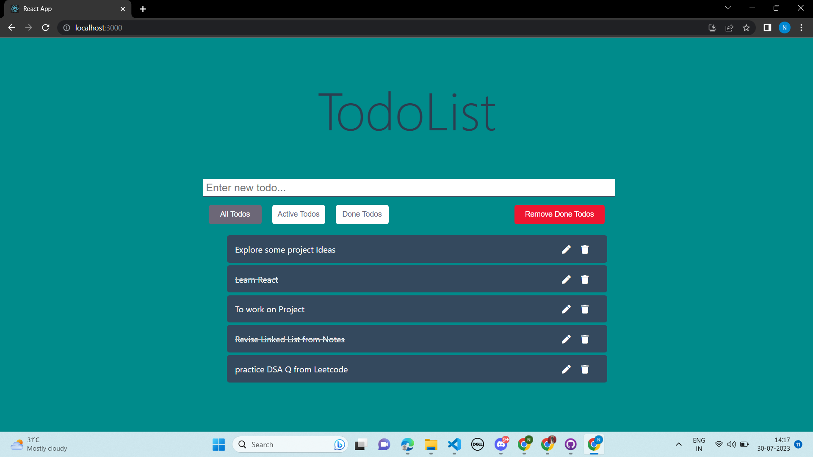
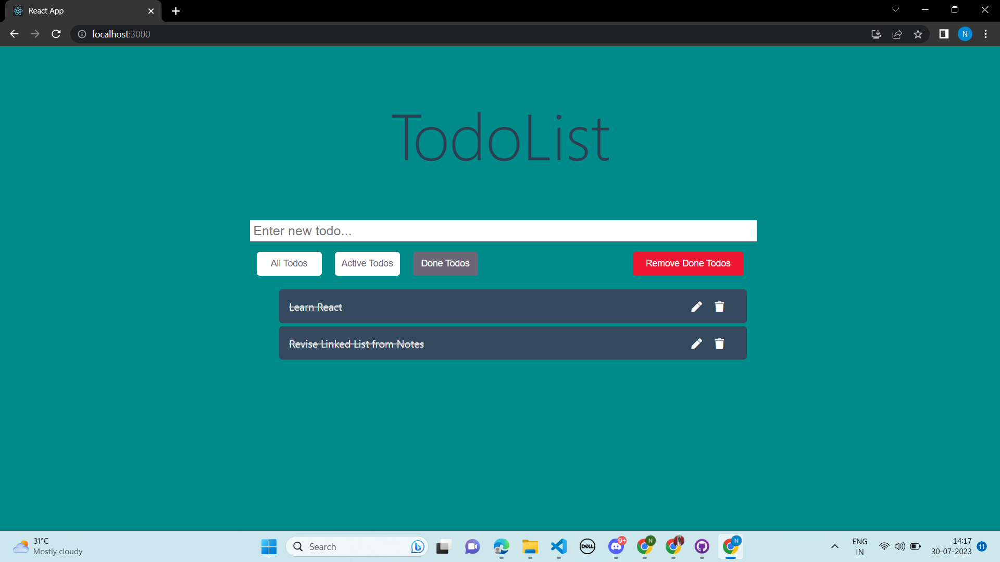
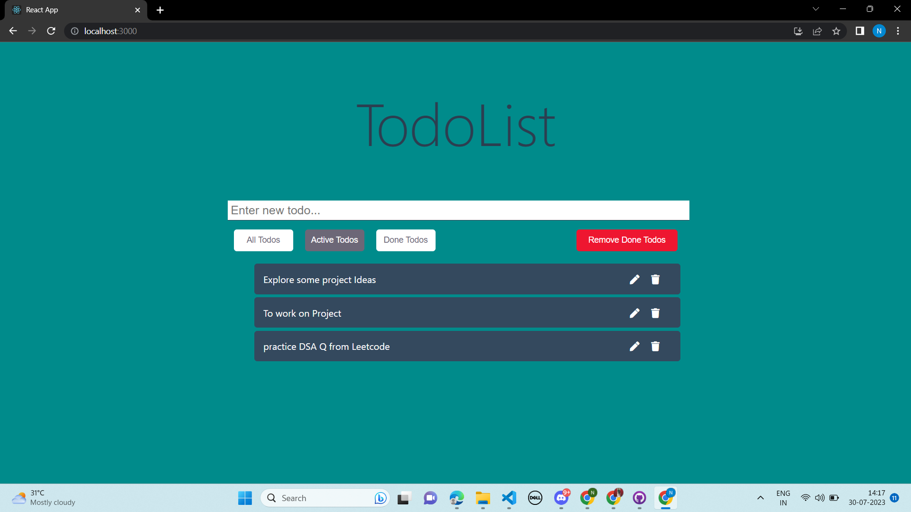

<!-- Author : Nikanshu Goyal -->

<h1> To-Do List Web Application (MERN Stack)</h1>

- Live Demo:👇

https://music-player-d.netlify.app/

## Project Overview:

The To-Do List web application is a simple task management system that allows users to create, read, update, and delete to-do items. 
The application is built using the MERN stack, which consists of MongoDB as the database, Express.js as the backend server, 
React.js for the frontend user interface, and Node.js as the server-side runtime environment.

## Technology Stack 

* Frontend: React.js, HTML, CSS
* Backend: Node.js, Express.js
* Database: MongoDB

## Features 

* Users can add new to-do items by entering a task description and pressing the *ENTER* button. The new item will be saved in the database.

* The application displays a list of existing to-do items fetched from the backend server. Users can view all their tasks at a glance.

* Users can mark tasks as DONE or modify the task description by clicking on the "Edit" icon next to the respective item.

* Users can delete a to-do item by clicking the "Delete" icon next to the task they wish to remove.

- [x] ALL TODo Page:

- [x] Done Todos Page:

- [x] Active Todos  Page:

